# User Management and Registration System

## Table of Contents

- [Overview](#overview)
- [Current System Architecture](#current-system-architecture)
- [Problems with Current System](#problems-with-current-system)
- [Proposed Solution Architecture](#proposed-solution-architecture)
- [Detailed Component Design](#detailed-component-design)
- [Registration Workflow](#registration-workflow)
- [User Linking Process](#user-linking-process)
- [Role Management](#role-management)
- [API Endpoints](#api-endpoints)
- [Database Schema](#database-schema)
- [Migration Strategy](#migration-strategy)
- [Security Considerations](#security-considerations)
- [Error Handling](#error-handling)

## Overview

This document describes the comprehensive user management and registration system for LeanSchool, addressing the current fragmentation between Keycloak authentication and local database user records. The system provides a unified approach to user identity management, role assignment, and registration workflows.

## Current System Architecture

### Current Data Flow

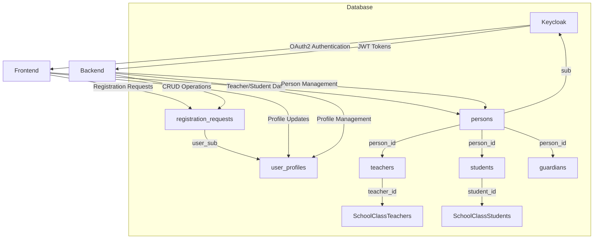

### Current Tables Structure

**registration_requests**
```
┌─────────────────────────────────────────────────┐
│ registration_requests                           │
├─────────────────────────────────────────────────┤
│ id            TEXT        PRIMARY KEY           │
│ user_sub      TEXT        NOT NULL UNIQUE       │
│ email         TEXT        NOT NULL              │
│ desired_roles TEXT[]      NOT NULL              │
│ status        TEXT        NOT NULL DEFAULT 'pending'
│ created_at    TIMESTAMPTZ NOT NULL DEFAULT NOW()
│ class_ids     TEXT[]      NOT NULL DEFAULT '{}' │
└─────────────────────────────────────────────────┘
```

**user_profiles**
```
┌─────────────────────────────────────────────────┐
│ user_profiles                                   │
├─────────────────────────────────────────────────┤
│ user_sub       TEXT    PRIMARY KEY              │
│ iban           TEXT    NOT NULL DEFAULT ''      │
│ address        TEXT    NOT NULL DEFAULT ''      │
│ phone          TEXT    NOT NULL DEFAULT ''      │
│ profile_complete BOOLEAN NOT NULL DEFAULT FALSE │
│ profile_skipped  BOOLEAN NOT NULL DEFAULT FALSE │
│ updated_at     TIMESTAMPTZ NOT NULL DEFAULT NOW()
│ class_ids      TEXT[]  NOT NULL DEFAULT '{}'    │
└─────────────────────────────────────────────────┘
```

**persons**
```
┌─────────────────────────────────────────────────┐
│ persons                                         │
├─────────────────────────────────────────────────┤
│ id              TEXT        PRIMARY KEY         │
│ name            TEXT        NOT NULL            │
│ prename         TEXT        NOT NULL DEFAULT '' │
│ date_of_birth   TIMESTAMPTZ                      │
│ address_id      TEXT        REFERENCES addresses(id)
│ sub             TEXT                            │
│ version         INT         NOT NULL DEFAULT 0  │
└─────────────────────────────────────────────────┘
```

## Problems with Current System

### 1. Fragmented User Identity

**Issue**: Users can exist in multiple systems without proper linking
- Keycloak users (authenticated) vs local database users (unauthenticated)
- No systematic way to connect Keycloak identities to database records
- `registration_requests.user_sub` vs `user_profiles.user_sub` vs `persons.sub`

**Example Problem Flow**:
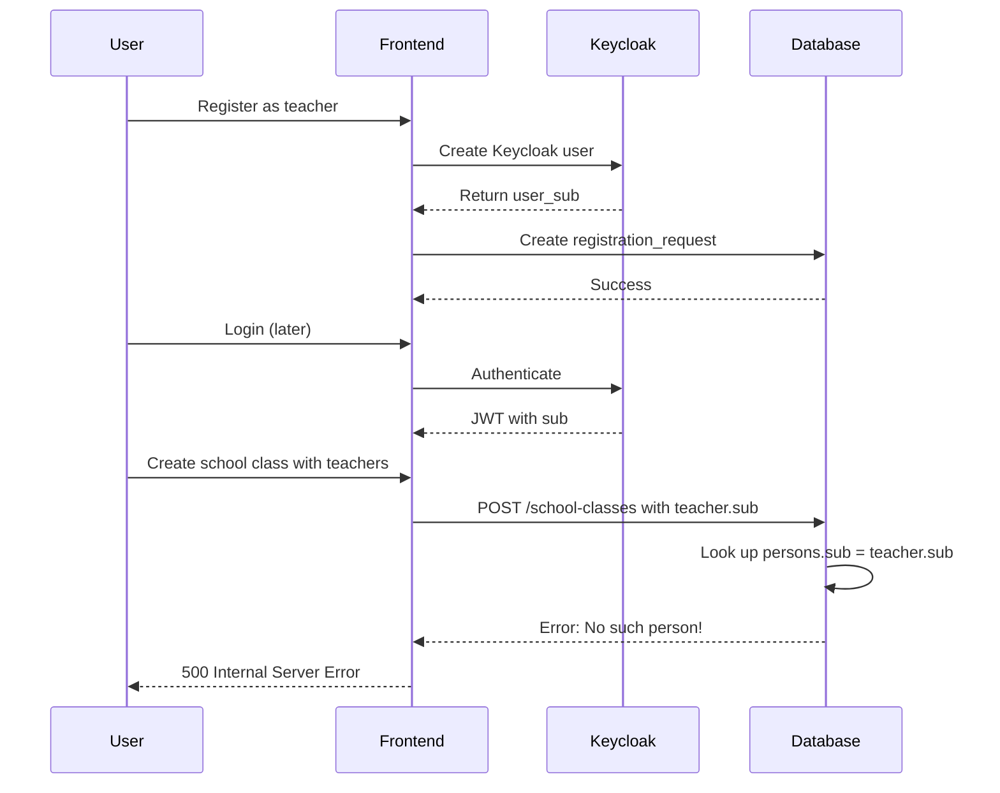

### 2. Incomplete Registration Flow

**Current Flow Issues**:
- Only handles basic user profiles, not role-specific data
- No automatic role assignment based on registration
- Teachers/students/guardians must be created manually after registration
- No approval workflow for sensitive roles

### 3. Data Redundancy and Inconsistency

**Redundant Data**:
- User profiles vs person records contain overlapping information
- Registration requests vs actual user data
- No single source of truth for user identity

### 4. Missing Role Synchronization

**Synchronization Gaps**:
- Keycloak roles not automatically reflected in local database
- Local role assignments not pushed to Keycloak
- Manual role management required in two systems

## Proposed Solution Architecture

### New System Overview

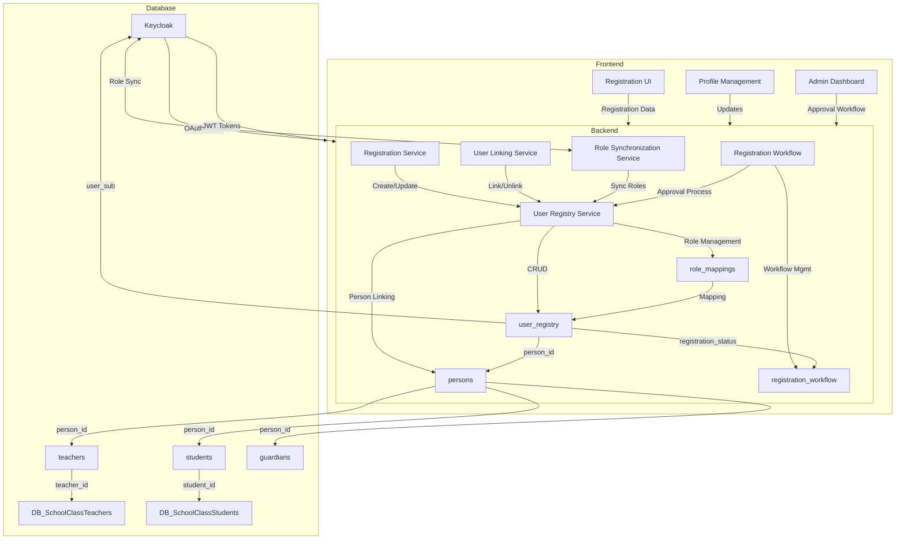

### Key Improvements

1. **Unified User Registry**: Single source of truth for all user identities
2. **Automatic Linking**: Keycloak users automatically linked to database records
3. **Complete Registration Workflow**: Handles all user types with approval process
4. **Role Synchronization**: Automatic sync between Keycloak and local database
5. **Backward Compatibility**: Supports migration from existing system

## Detailed Component Design

### 1. User Registry Service

**Purpose**: Centralized user identity management that bridges Keycloak authentication with local database records.

**Database Schema**:
```sql
CREATE TABLE IF NOT EXISTS user_registry (
    id                TEXT PRIMARY KEY,
    user_sub          TEXT UNIQUE,                    -- Keycloak subject ID
    person_id         TEXT REFERENCES persons(id),    -- Link to person record
    email             TEXT,                           -- Primary email
    registration_status TEXT NOT NULL DEFAULT 'pending', -- pending, approved, rejected, active, legacy
    keycloak_roles    TEXT[] NOT NULL DEFAULT '{}',  -- Roles from Keycloak
    local_roles       TEXT[] NOT NULL DEFAULT '{}',  -- Roles in local system
    last_role_sync    TIMESTAMPTZ,                    -- Last role synchronization time
    created_at        TIMESTAMPTZ NOT NULL DEFAULT NOW(),
    updated_at        TIMESTAMPTZ NOT NULL DEFAULT NOW(),
    last_login_at     TIMESTAMPTZ,                    -- Last successful login
    
    -- Deprecated fields for migration
    legacy_profile_id TEXT REFERENCES user_profiles(user_sub),
    legacy_request_id TEXT REFERENCES registration_requests(user_sub),
    
    -- Audit fields
    created_by        TEXT REFERENCES user_registry(id),
    updated_by        TEXT REFERENCES user_registry(id)
);
```

**Key Functions**:
- `GetUserBySub(sub string) (*UserRegistry, error)` - Get user by Keycloak subject ID
- `GetUserByPersonID(personID string) (*UserRegistry, error)` - Get user by person ID
- `CreateUser(user UserRegistry) error` - Create new user registry entry
- `UpdateUser(user UserRegistry) error` - Update existing user
- `LinkPerson(userID, personID string) error` - Link user to person record
- `SyncRoles(userID string, keycloakRoles []string) error` - Synchronize roles

### 2. Registration Workflow Service

**Purpose**: Manage the complete registration process from initial request through approval to activation.

**Database Schema**:
```sql
CREATE TABLE IF NOT EXISTS registration_workflow (
    id               TEXT PRIMARY KEY,
    user_id          TEXT REFERENCES user_registry(id), -- Who is registering
    request_type     TEXT NOT NULL,                    -- teacher, student, guardian, multi
    request_data     JSONB NOT NULL,                   -- Original request data
    desired_roles    TEXT[] NOT NULL,                  -- Roles user wants
    current_roles    TEXT[] NOT NULL DEFAULT '{}',    -- Roles user currently has
    approval_status  TEXT NOT NULL DEFAULT 'pending', -- pending, approved, rejected, cancelled
    approval_by      TEXT REFERENCES user_registry(id), -- Who approved
    approval_at      TIMESTAMPTZ,
    approval_notes   TEXT,
    rejection_reason TEXT,
    rejection_by     TEXT REFERENCES user_registry(id),
    rejection_at     TIMESTAMPTZ,
    
    -- Workflow state
    requires_manual_approval BOOLEAN NOT NULL DEFAULT TRUE,
    auto_approval_rules      JSONB, -- Rules for auto-approval
    
    -- Timestamps
    created_at       TIMESTAMPTZ NOT NULL DEFAULT NOW(),
    updated_at       TIMESTAMPTZ NOT NULL DEFAULT NOW(),
    completed_at     TIMESTAMPTZ,
    
    -- Related entities that need to be created
    pending_teacher_id TEXT REFERENCES teachers(person_id),
    pending_student_id TEXT REFERENCES students(person_id),
    pending_guardian_id TEXT REFERENCES guardians(person_id)
);
```

**Workflow States**:
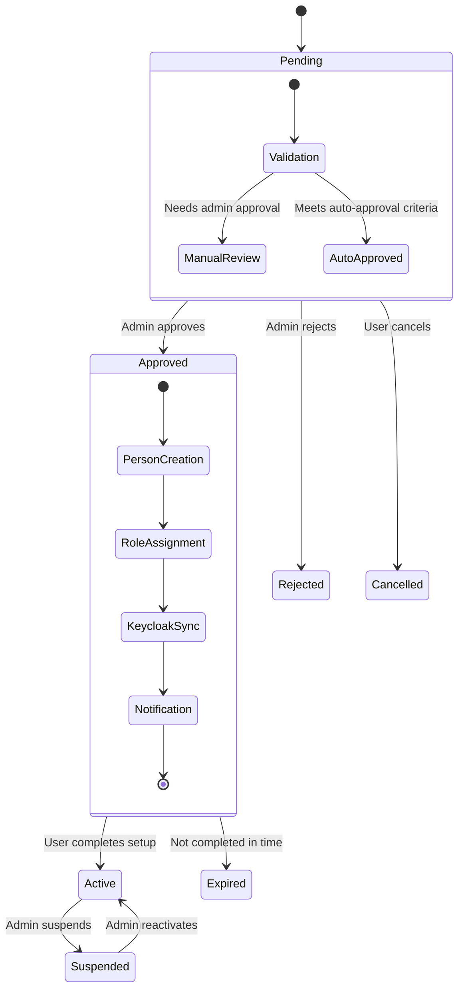

**Key Functions**:
- `SubmitRegistration(request RegistrationRequest) (string, error)` - Submit new registration
- `ApproveRegistration(workflowID string, approverID string) error` - Approve registration
- `RejectRegistration(workflowID string, reason string, rejectorID string) error` - Reject registration
- `GetPendingRegistrations() ([]RegistrationWorkflow, error)` - Get registrations needing approval
- `CompleteRegistration(workflowID string) error` - Mark registration as complete

### 3. Role Management System

**Purpose**: Synchronize roles between Keycloak and local database with configurable mappings.

**Database Schema**:
```sql
CREATE TABLE IF NOT EXISTS role_mappings (
    keycloak_role   TEXT PRIMARY KEY,                   -- Keycloak role name
    local_role      TEXT NOT NULL UNIQUE,              -- Local role name
    description     TEXT NOT NULL,                     -- Human-readable description
    auto_assign     BOOLEAN NOT NULL DEFAULT FALSE,     -- Auto-assign when Keycloak role detected
    auto_create     BOOLEAN NOT NULL DEFAULT FALSE,     -- Auto-create local entities when assigned
    requires_approval BOOLEAN NOT NULL DEFAULT TRUE,   -- Requires admin approval
    
    -- Role capabilities
    can_teach       BOOLEAN NOT NULL DEFAULT FALSE,
    can_manage_classes BOOLEAN NOT NULL DEFAULT FALSE,
    can_manage_users BOOLEAN NOT NULL DEFAULT FALSE,
    can_view_reports BOOLEAN NOT NULL DEFAULT FALSE,
    
    -- UI settings
    show_in_registration BOOLEAN NOT NULL DEFAULT TRUE,
    registration_order INT NOT NULL DEFAULT 0,
    
    created_at      TIMESTAMPTZ NOT NULL DEFAULT NOW(),
    updated_at      TIMESTAMPTZ NOT NULL DEFAULT NOW()
);

-- Example initial data
INSERT INTO role_mappings (keycloak_role, local_role, description, auto_assign, requires_approval, can_teach, show_in_registration, registration_order)
VALUES 
    ('teacher', 'teacher', 'Teaching staff member', TRUE, FALSE, TRUE, TRUE, 1),
    ('student', 'student', 'Student at the school', TRUE, FALSE, FALSE, TRUE, 2),
    ('guardian', 'guardian', 'Parent or legal guardian', TRUE, FALSE, FALSE, TRUE, 3),
    ('school-management', 'school_management', 'School administrator', FALSE, TRUE, FALSE, FALSE, 4);
```

**Role Synchronization Process**:
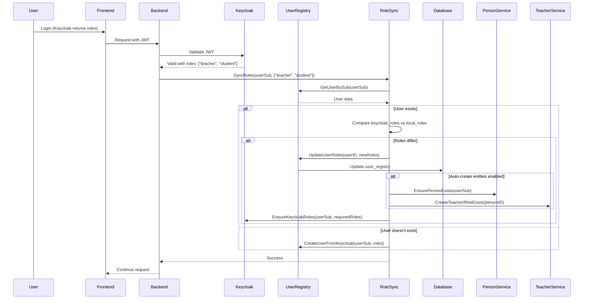

### 4. User Linking System

**Purpose**: Automatically create and link person records when users are detected in Keycloak but not in the local database.

**Linking Process**:
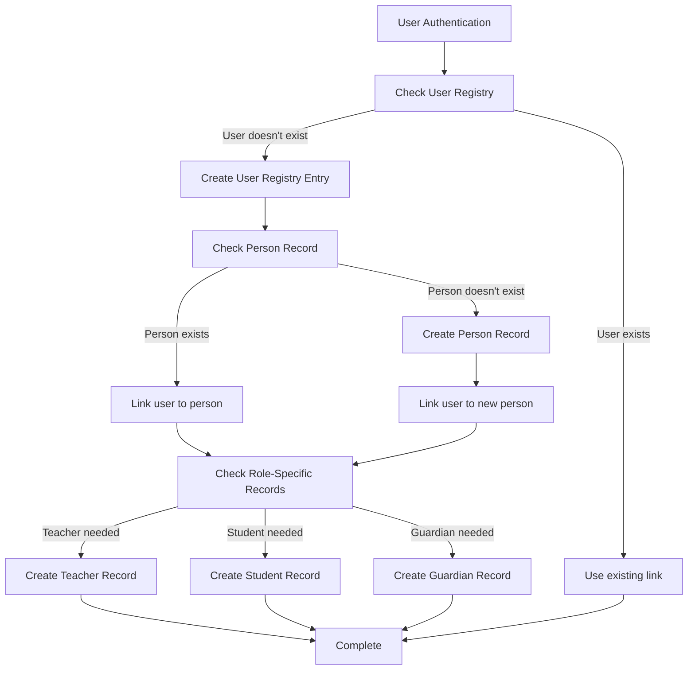

**Key Functions**:
```go
// EnsureUserLinked ensures a user is properly linked to a person record
func (s *UserService) EnsureUserLinked(ctx context.Context, userSub string, personData model.Person) error {
    tx, err := s.db.BeginTx(ctx, nil)
    if err != nil {
        return err
    }
    defer tx.Rollback()
    
    // 1. Get or create user registry entry
    user, err := s.getOrCreateUserRegistry(ctx, tx, userSub)
    if err != nil {
        return fmt.Errorf("creating user registry: %w", err)
    }
    
    // 2. Get or create person record
    person, err := s.getOrCreatePerson(ctx, tx, userSub, personData)
    if err != nil {
        return fmt.Errorf("creating person: %w", err)
    }
    
    // 3. Link user to person if not already linked
    if user.PersonID != person.ID {
        if _, err := tx.ExecContext(ctx, 
            `UPDATE user_registry SET person_id = $1 WHERE id = $2`,
            person.ID, user.ID
        ); err != nil {
            return fmt.Errorf("linking user to person: %w", err)
        }
    }
    
    // 4. Sync roles from Keycloak
    if err := s.syncRolesFromKeycloak(ctx, tx, userSub, user.ID); err != nil {
        return fmt.Errorf("syncing roles: %w", err)
    }
    
    return tx.Commit()
}
```

## Registration Workflow

### Complete Registration Process

```mermaid
graph LR
    %% Registration Phases
    subgraph Phase1[Phase 1: Initial Registration]
        A[User visits registration page] --> B[Select role(s)]
        B --> C[Provide basic info]
        C --> D[Submit registration]
    end
    
    subgraph Phase2[Phase 2: Backend Processing]
        D --> E[Create user_registry entry]
        E --> F[Create registration_workflow entry]
        F --> G[Check auto-approval rules]
        G -->|Auto-approve| H[Auto-approval path]
        G -->|Manual required| I[Manual approval path]
    end
    
    subgraph Phase3[Phase 3: Approval Process]
        I --> J[Notify admins]
        J --> K[Admin reviews request]
        K -->|Approve| L[Approval granted]
        K -->|Reject| M[Rejection with reason]
        M --> N[Notify user of rejection]
    end
    
    subgraph Phase4[Phase 4: Post-Approval]
        L --> O[Create person record]
        H --> O
        O --> P[Create role-specific records]
        P --> Q[Assign Keycloak roles]
        Q --> R[Send welcome email]
        R --> S[Registration complete]
    end
    
    subgraph Phase5[Phase 5: User Activation]
        S --> T[User receives notification]
        T --> U[User logs in]
        U --> V[Complete profile setup]
        V --> W[Active user]
    end
    
    style A fill:#f9f,stroke:#333
    style W fill:#9f9,stroke:#333
```

### Registration API Flow

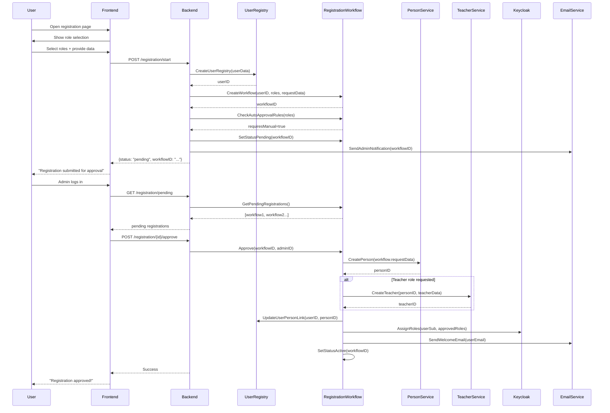

### Registration States and Transitions

**State Machine**:
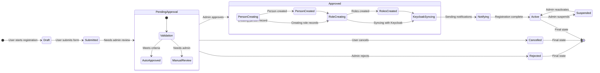

## User Linking Process

### Linking Scenarios

**Scenario 1: New Keycloak User (First Login)**
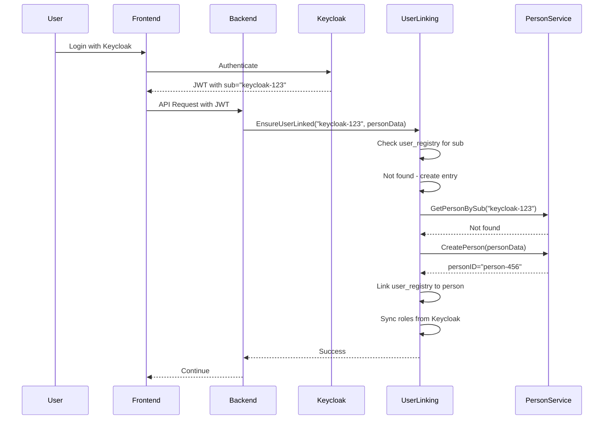

**Scenario 2: Existing User (Subsequent Logins)**
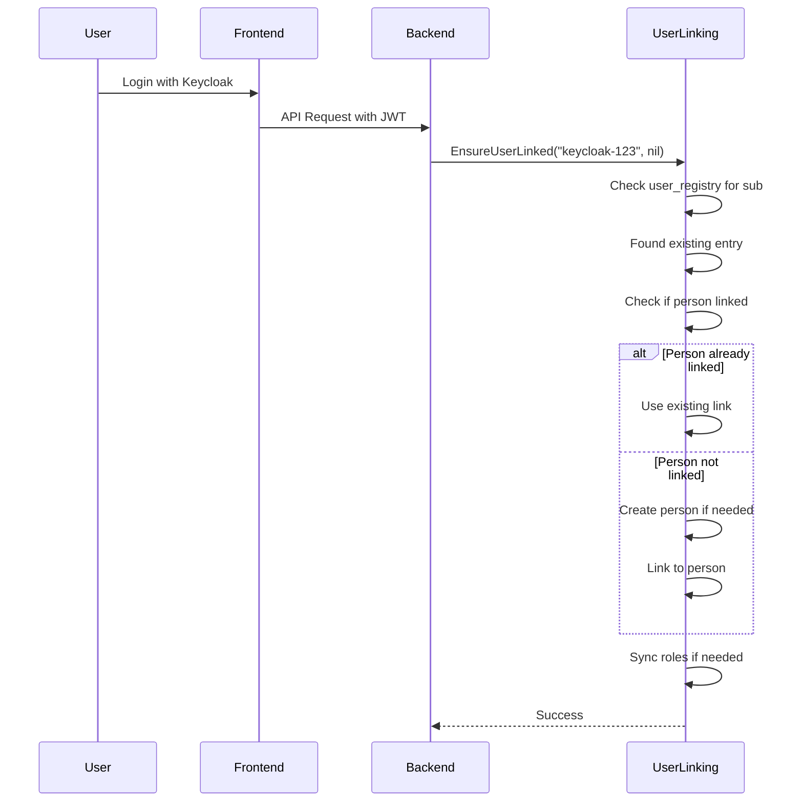

### Linking Algorithm

```go
func (s *UserService) EnsureUserLinked(ctx context.Context, userSub string, personData *model.Person) error {
    // Step 1: Get or create user registry entry
    user, err := s.getOrCreateUserRegistry(ctx, userSub)
    if err != nil {
        return fmt.Errorf("user registry setup failed: %w", err)
    }
    
    // Step 2: Handle person linking
    if user.PersonID == "" {
        // Person not linked yet
        if personData != nil {
            // We have person data - create or update person
            person, err := s.getOrCreatePerson(ctx, userSub, *personData)
            if err != nil {
                return fmt.Errorf("person setup failed: %w", err)
            }
            
            // Link user to person
            if err := s.linkUserToPerson(ctx, user.ID, person.ID); err != nil {
                return fmt.Errorf("linking failed: %w", err)
            }
            user.PersonID = person.ID
        } else {
            // No person data provided - check if person exists
            person, err := s.getPersonBySub(ctx, userSub)
            if err == nil {
                // Person exists - link to it
                if err := s.linkUserToPerson(ctx, user.ID, person.ID); err != nil {
                    return fmt.Errorf("linking failed: %w", err)
                }
                user.PersonID = person.ID
            }
            // If no person exists and no data provided, that's okay - person will be created later
        }
    }
    
    // Step 3: Sync roles from Keycloak
    if err := s.syncRolesFromKeycloak(ctx, userSub, user.ID); err != nil {
        return fmt.Errorf("role sync failed: %w", err)
    }
    
    return nil
}
```

## Role Management

### Role Synchronization Process

**Synchronization Directions**:
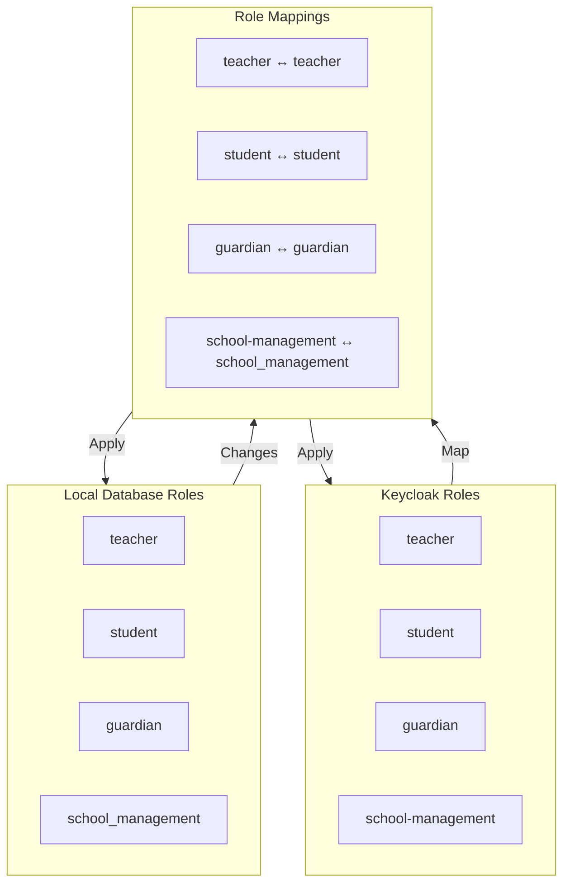

### Role Assignment Flow

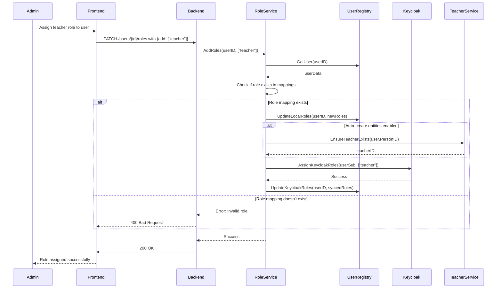

### Role-Based Access Control Matrix

**Current Role Permissions** (from datamodel.md):

| Model            | Read Role              | Write Role(s)                              | Teacher Access     | School Management Access |
|------------------|------------------------|--------------------------------------------|--------------------|--------------------------|
| Location         | location_read          | location_write                             | R                  | R+W                     |
| Building         | building_read          | building_write                             | R                  | R+W                     |
| Room             | room_read              | room_write                                 | R                  | R+W                     |
| PostalCode       | postalcode_read        | postalcode_write                           | R                  | R+W                     |
| City             | city_read              | city_write                                 | R                  | R+W                     |
| Address          | address_read           | address_write                              | R                  | R+W                     |
| Person           | person_read            | person_write                               | R                  | R+W                     |
| Guardian         | guardian_read          | guardian_write                             | R                  | R+W                     |
| Teacher          | teacher_read           | teacher_write_own / teacher_write_all      | R+W_own           | R+W_all                 |
| Student          | student_read           | student_write                              | R                  | R+W                     |
| SchoolYear       | schoolyear_read        | schoolyear_write                           | R                  | R+W                     |
| SchoolClass      | schoolclass_read       | schoolclass_write_own / schoolclass_write_all  | R+W_own        | R+W_all                 |
| Curriculum       | curriculum_read        | curriculum_write                           | R                  | R+W                     |
| Subject          | subject_read           | subject_write                              | R                  | R+W                     |
| Lesson           | lesson_read            | lesson_write_own / lesson_write_all        | R+W_own           | R+W_all                 |
| Exam             | exam_read              | exam_write_own / exam_write_all            | R+W_own           | R+W_all                 |
| Grade            | grade_read             | grade_write_own / grade_write_all          | R+W_own           | R+W_all                 |

**Ownership Rules**:
- **Teacher**: `write_own` → JWT sub must match teacher.sub
- **SchoolClass**: `write_own` → JWT sub must be in schoolClass.teachers[].sub
- **Lesson**: `write_own` → JWT sub must match lesson.teacher.sub
- **Exam**: `write_own` → JWT sub must be teacher of exam.schoolClass
- **Grade**: `write_own` → JWT sub must be teacher of grade.exam.schoolClass

## API Endpoints

### User Registry Endpoints

**GET /users/registry**
- **Description**: List all users in registry
- **Roles**: `user_management_read`
- **Response**: `UserRegistry[]`

**GET /users/registry/{id}**
- **Description**: Get specific user registry entry
- **Roles**: `user_management_read`
- **Response**: `UserRegistry`

**GET /users/registry/by-sub/{sub}**
- **Description**: Get user by Keycloak subject ID
- **Roles**: `user_management_read`
- **Response**: `UserRegistry`

**POST /users/registry**
- **Description**: Create new user registry entry
- **Roles**: `user_management_write`
- **Request**: `UserRegistry` (without ID)
- **Response**: `UserRegistry` (with ID)

**PATCH /users/registry/{id}**
- **Description**: Update user registry entry
- **Roles**: `user_management_write`
- **Request**: `UserRegistry` (partial)
- **Response**: `UserRegistry` (complete)

**POST /users/registry/{id}/link**
- **Description**: Link user to person record
- **Roles**: `user_management_write`
- **Request**: `{person_id: string}`
- **Response**: `UserRegistry`

### Registration Workflow Endpoints

**GET /registration/workflow**
- **Description**: List all registration workflows
- **Roles**: `user_management_read`
- **QueryParams**: `status=pending|approved|rejected`
- **Response**: `RegistrationWorkflow[]`

**GET /registration/workflow/{id}**
- **Description**: Get specific registration workflow
- **Roles**: `user_management_read` or owner
- **Response**: `RegistrationWorkflow`

**POST /registration/start**
- **Description**: Start new registration process
- **Roles**: None (public)
- **Request**:
  ```json
  {
    "desiredRoles": ["teacher", "guardian"],
    "personData": {
      "name": "John",
      "prename": "Doe",
      "dateOfBirth": "1985-05-15"
    },
    "teacherData": {
      "iban": "CH123456789",
      "atSchoolSince": "2023-01-01T00:00:00Z"
    },
    "contactEmail": "john.doe@example.com"
  }
  ```
- **Response**: `{status: "pending", workflowId: "...", message: "Registration submitted"}`

**POST /registration/{id}/approve**
- **Description**: Approve registration request
- **Roles**: `user_management_write`
- **Request**: `{notes: "Approved by admin"}`
- **Response**: `RegistrationWorkflow` (updated)

**POST /registration/{id}/reject**
- **Description**: Reject registration request
- **Roles**: `user_management_write`
- **Request**: `{reason: "Incomplete information"}`
- **Response**: `RegistrationWorkflow` (updated)

**POST /registration/{id}/cancel**
- **Description**: Cancel own registration request
- **Roles**: Owner or `user_management_write`
- **Response**: `RegistrationWorkflow` (updated)

### User Linking Endpoints

**POST /users/link**
- **Description**: Ensure user is linked to person record
- **Roles**: `user_management_write` or self
- **Request**:
  ```json
  {
    "userSub": "keycloak-123",
    "personData": {
      "name": "John",
      "prename": "Doe"
    }
  }
  ```
- **Response**: `UserRegistry` (linked)

**GET /users/{id}/link-status**
- **Description**: Check linking status
- **Roles**: `user_management_read` or self
- **Response**: `{linked: true, personId: "...", roles: [...]}`

### Role Management Endpoints

**GET /roles/mappings**
- **Description**: List all role mappings
- **Roles**: `user_management_read`
- **Response**: `RoleMapping[]`

**GET /roles/mappings/{keycloakRole}**
- **Description**: Get specific role mapping
- **Roles**: `user_management_read`
- **Response**: `RoleMapping`

**POST /roles/mappings**
- **Description**: Create new role mapping
- **Roles**: `user_management_write`
- **Request**: `RoleMapping` (without keycloak_role if auto-generated)
- **Response**: `RoleMapping`

**PATCH /roles/mappings/{keycloakRole}**
- **Description**: Update role mapping
- **Roles**: `user_management_write`
- **Request**: `RoleMapping` (partial)
- **Response**: `RoleMapping`

**POST /users/{id}/roles**
- **Description**: Add roles to user
- **Roles**: `user_management_write`
- **Request**: `{add: ["teacher", "guardian"]}`
- **Response**: `UserRegistry` (updated)

**DELETE /users/{id}/roles**
- **Description**: Remove roles from user
- **Roles**: `user_management_write`
- **Request**: `{remove: ["teacher"]}`
- **Response**: `UserRegistry` (updated)

**POST /users/{id}/roles/sync**
- **Description**: Force role synchronization with Keycloak
- **Roles**: `user_management_write` or self
- **Response**: `{synced: true, keycloakRoles: [...], localRoles: [...]}`

## Database Schema

### Complete Database Schema

**user_registry**
```sql
CREATE TABLE IF NOT EXISTS user_registry (
    id                TEXT PRIMARY KEY,
    user_sub          TEXT UNIQUE,
    person_id         TEXT REFERENCES persons(id),
    email             TEXT,
    registration_status TEXT NOT NULL DEFAULT 'pending',
    keycloak_roles    TEXT[] NOT NULL DEFAULT '{}',
    local_roles       TEXT[] NOT NULL DEFAULT '{}',
    last_role_sync    TIMESTAMPTZ,
    created_at        TIMESTAMPTZ NOT NULL DEFAULT NOW(),
    updated_at        TIMESTAMPTZ NOT NULL DEFAULT NOW(),
    last_login_at     TIMESTAMPTZ,
    created_by        TEXT REFERENCES user_registry(id),
    updated_by        TEXT REFERENCES user_registry(id),
    legacy_profile_id TEXT REFERENCES user_profiles(user_sub),
    legacy_request_id TEXT REFERENCES registration_requests(user_sub)
);

CREATE INDEX IF NOT EXISTS idx_user_registry_person_id ON user_registry(person_id);
CREATE INDEX IF NOT EXISTS idx_user_registry_status ON user_registry(registration_status);
CREATE INDEX IF NOT EXISTS idx_user_registry_email ON user_registry(email);
```

**registration_workflow**
```sql
CREATE TABLE IF NOT EXISTS registration_workflow (
    id                   TEXT PRIMARY KEY,
    user_id              TEXT REFERENCES user_registry(id),
    request_type         TEXT NOT NULL,
    request_data         JSONB NOT NULL,
    desired_roles        TEXT[] NOT NULL,
    current_roles        TEXT[] NOT NULL DEFAULT '{}',
    approval_status      TEXT NOT NULL DEFAULT 'pending',
    approval_by          TEXT REFERENCES user_registry(id),
    approval_at          TIMESTAMPTZ,
    approval_notes       TEXT,
    rejection_reason     TEXT,
    rejection_by         TEXT REFERENCES user_registry(id),
    rejection_at         TIMESTAMPTZ,
    requires_manual_approval BOOLEAN NOT NULL DEFAULT TRUE,
    auto_approval_rules  JSONB,
    pending_teacher_id   TEXT REFERENCES teachers(person_id),
    pending_student_id   TEXT REFERENCES students(person_id),
    pending_guardian_id  TEXT REFERENCES guardians(person_id),
    created_at           TIMESTAMPTZ NOT NULL DEFAULT NOW(),
    updated_at           TIMESTAMPTZ NOT NULL DEFAULT NOW(),
    completed_at         TIMESTAMPTZ
);

CREATE INDEX IF NOT EXISTS idx_registration_workflow_user_id ON registration_workflow(user_id);
CREATE INDEX IF NOT EXISTS idx_registration_workflow_status ON registration_workflow(approval_status);
CREATE INDEX IF NOT EXISTS idx_registration_workflow_created_at ON registration_workflow(created_at);
```

**role_mappings**
```sql
CREATE TABLE IF NOT EXISTS role_mappings (
    keycloak_role     TEXT PRIMARY KEY,
    local_role        TEXT NOT NULL UNIQUE,
    description       TEXT NOT NULL,
    auto_assign       BOOLEAN NOT NULL DEFAULT FALSE,
    auto_create       BOOLEAN NOT NULL DEFAULT FALSE,
    requires_approval BOOLEAN NOT NULL DEFAULT TRUE,
    can_teach         BOOLEAN NOT NULL DEFAULT FALSE,
    can_manage_classes BOOLEAN NOT NULL DEFAULT FALSE,
    can_manage_users  BOOLEAN NOT NULL DEFAULT FALSE,
    can_view_reports  BOOLEAN NOT NULL DEFAULT FALSE,
    show_in_registration BOOLEAN NOT NULL DEFAULT TRUE,
    registration_order INT NOT NULL DEFAULT 0,
    created_at        TIMESTAMPTZ NOT NULL DEFAULT NOW(),
    updated_at        TIMESTAMPTZ NOT NULL DEFAULT NOW()
);
```

## Migration Strategy

### Phase 1: Database Preparation

**Step 1: Create New Tables**
```sql
-- Run these migrations first
CREATE TABLE IF NOT EXISTS user_registry (...);
CREATE TABLE IF NOT EXISTS registration_workflow (...);
CREATE TABLE IF NOT EXISTS role_mappings (...);
```

**Step 2: Populate Role Mappings**
```sql
-- Insert initial role mappings
INSERT INTO role_mappings (keycloak_role, local_role, description, auto_assign, requires_approval, can_teach, show_in_registration, registration_order)
VALUES 
    ('teacher', 'teacher', 'Teaching staff member', TRUE, FALSE, TRUE, TRUE, 1),
    ('student', 'student', 'Student at the school', TRUE, FALSE, FALSE, TRUE, 2),
    ('guardian', 'guardian', 'Parent or legal guardian', TRUE, FALSE, FALSE, TRUE, 3),
    ('school-management', 'school_management', 'School administrator', FALSE, TRUE, FALSE, FALSE, 4);
```

### Phase 2: Data Migration

**Step 3: Migrate Registration Requests**
```sql
-- Migrate existing registration_requests to new system
INSERT INTO registration_workflow (id, user_id, request_data, desired_roles, approval_status, created_at)
SELECT 
    rr.id, 
    (SELECT ur.id FROM user_registry ur WHERE ur.user_sub = rr.user_sub) as user_id,
    json_build_object('email', rr.email, 'class_ids', rr.class_ids) as request_data,
    rr.desired_roles,
    CASE 
        WHEN rr.status = 'approved' THEN 'approved' 
        WHEN rr.status = 'rejected' THEN 'rejected'
        ELSE 'pending'
    END as approval_status,
    rr.created_at
FROM registration_requests rr
ON CONFLICT (id) DO NOTHING;
```

**Step 4: Migrate User Profiles**
```sql
-- Migrate existing user_profiles to user_registry
INSERT INTO user_registry (id, user_sub, email, registration_status, created_at, updated_at, legacy_profile_id)
SELECT 
    up.user_sub as id,
    up.user_sub,
    NULL as email, -- Email not stored in user_profiles
    CASE 
        WHEN up.profile_complete THEN 'active' 
        WHEN up.profile_skipped THEN 'active' 
        ELSE 'pending'
    END as registration_status,
    NOW() as created_at,
    up.updated_at,
    up.user_sub as legacy_profile_id
FROM user_profiles up
ON CONFLICT (user_sub) DO NOTHING;
```

**Step 5: Link Persons to Users**
```sql
-- Link existing persons to user_registry
UPDATE user_registry ur 
SET person_id = p.id 
FROM persons p 
WHERE ur.user_sub = p.sub AND ur.person_id IS NULL;
```

### Phase 3: Backend Implementation

**Step 6: Implement Core Services**
```bash
# Implementation order:
1. UserRegistry service (CRUD operations)
2. RegistrationWorkflow service (workflow management)
3. RoleSynchronization service (role sync logic)
4. UserLinking service (automatic linking)
5. Update existing handlers to use new services
```

### Phase 4: API Updates

**Step 7: Add New Endpoints**
```go
// Add to cmd/main.go
mux.HandleFunc("POST /registration/start", h.StartRegistration)
mux.HandleFunc("GET /registration/workflow", h.ListRegistrationWorkflows)
mux.HandleFunc("POST /registration/{id}/approve", h.ApproveRegistration)
mux.HandleFunc("POST /users/link", h.EnsureUserLinked)
mux.HandleFunc("POST /users/{id}/roles/sync", h.SyncUserRoles)
```

### Phase 5: Frontend Updates

**Step 8: Update Registration Flow**
```javascript
// New registration process:
1. Select roles (teacher/student/guardian)
2. Provide personal information
3. Provide role-specific information
4. Submit for approval
5. Receive confirmation
6. Wait for admin approval
7. Complete profile setup
```

### Phase 6: Testing and Validation

**Step 9: Test Migration**
```bash
# Test data migration
1. Backup existing database
2. Run migration scripts
3. Verify data integrity
4. Test new endpoints
5. Test backward compatibility
```

**Step 10: Gradual Rollout**
```bash
# Rollout strategy:
1. Deploy new backend with both old and new endpoints
2. Update frontend to use new endpoints
3. Monitor for issues
4. Deprecate old endpoints after stabilization
5. Clean up legacy code
```

## Security Considerations

### Authentication and Authorization

**JWT Validation**:
- All API endpoints validate JWT tokens
- Keycloak issuer validation
- Token signature verification
- Role-based access control

**Role-Based Access Control**:
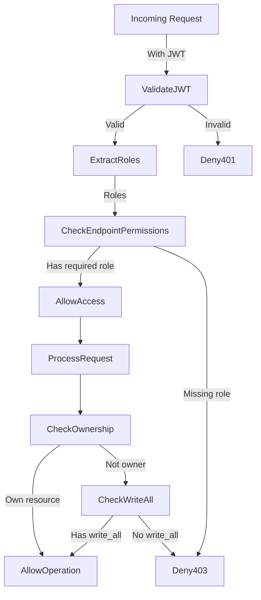

### Data Protection

**Sensitive Data Handling**:
- Personal data encrypted at rest
- HTTPS for all communications
- Minimal data exposure in APIs
- Audit logging for sensitive operations

**Audit Logging**:
```sql
CREATE TABLE IF NOT EXISTS audit_logs (
    id              TEXT PRIMARY KEY,
    timestamp       TIMESTAMPTZ NOT NULL DEFAULT NOW(),
    user_id         TEXT REFERENCES user_registry(id),
    action          TEXT NOT NULL, -- create, read, update, delete, login, logout
    entity_type     TEXT NOT NULL, -- user, registration, role, etc.
    entity_id       TEXT,
    old_value       JSONB,
    new_value       JSONB,
    ip_address      TEXT,
    user_agent      TEXT,
    status          TEXT NOT NULL -- success, failure, unauthorized
);
```

### Role Assignment Security

**Secure Role Assignment**:
- Admin approval required for sensitive roles
- Role assignment audit trail
- Role change notifications
- Prevention of role escalation

## Error Handling

### Common Error Scenarios

**Scenario 1: User Not Found**
```json
{
    "error": "user_not_found",
    "message": "User with sub 'keycloak-123' not found",
    "suggestedAction": "The user may need to register first",
    "status": 404
}
```

**Scenario 2: Registration Pending**
```json
{
    "error": "registration_pending",
    "message": "Registration request is still pending approval",
    "workflowId": "workflow-456",
    "status": 403
}
```

**Scenario 3: Insufficient Permissions**
```json
{
    "error": "insufficient_permissions",
    "message": "User lacks required role 'user_management_write'",
    "requiredRoles": ["user_management_write"],
    "userRoles": ["teacher_read"],
    "status": 403
}
```

**Scenario 4: Role Synchronization Failed**
```json
{
    "error": "role_sync_failed",
    "message": "Failed to synchronize roles with Keycloak",
    "details": "Keycloak API unavailable",
    "localRoles": ["teacher"],
    "keycloakRoles": [],
    "status": 500
}
```

### Error Recovery Strategies

**Automatic Recovery**:
- Retry failed Keycloak operations
- Queue failed sync operations
- Background job for retrying failed operations

**Manual Recovery**:
- Admin interface for fixing broken links
- Manual role assignment override
- Data repair tools

## Conclusion

This comprehensive user management and registration system addresses the current fragmentation between Keycloak authentication and local database records. By implementing a unified user registry, complete registration workflow, and automatic role synchronization, the system provides:

1. **Single Source of Truth**: All user identities managed in one place
2. **Seamless Integration**: Keycloak and local database stay in sync
3. **Complete Workflow**: From registration to approval to activation
4. **Role-Based Security**: Fine-grained access control
5. **Backward Compatibility**: Smooth migration from existing system

The proposed solution resolves the immediate linking problems while providing a foundation for future enhancements in user management, access control, and system integration.